# UML Class Diagram - Geography Quiz Game

## Overview
This class diagram represents the object-oriented structure of the Geography Quiz Game application, demonstrating the relationships between classes and the implementation of OOP principles including inheritance, encapsulation, and abstraction.

## Class Diagram

```mermaid
classDiagram
    %% Abstract Base Class
    class Question {
        <<abstract>>
        -int _id
        -string _questionText
        -string _correctAnswer
        +int Id
        +string QuestionText
        +string CorrectAnswer
        +string QuestionType*
        +Question(int id, string questionText, string correctAnswer)
        +bool IsAnswerCorrect(string userAnswer)*
        +string GetDisplayText()
        +string ToString()
    }

    %% Concrete Question Classes
    class MultipleChoiceQuestion {
        -List~string~ _options
        -int _correctOptionIndex
        +List~string~ Options
        +int CorrectOptionIndex
        +string QuestionType
        +MultipleChoiceQuestion(int id, string questionText, List~string~ options, int correctOptionIndex)
        +bool IsAnswerCorrect(string userAnswer)
        +string GetDisplayText()
        +string GetOption(int index)
        +bool IsAnswerCorrectByIndex(int selectedIndex)
    }

    class OpenEndedQuestion {
        -List~string~ _alternativeAnswers
        +List~string~ AlternativeAnswers
        +string QuestionType
        +OpenEndedQuestion(int id, string questionText, string correctAnswer, List~string~ alternativeAnswers)
        +bool IsAnswerCorrect(string userAnswer)
        +void AddAlternativeAnswer(string alternativeAnswer)
        +void RemoveAlternativeAnswer(string alternativeAnswer)
        +List~string~ GetAllCorrectAnswers()
        +string GetDisplayText()
        +bool IsAnswerLengthValid(string answer)
        -string NormalizeAnswer(string answer)
    }

    class TrueFalseQuestion {
        -bool _isTrue
        +bool IsTrue
        +string QuestionType
        +TrueFalseQuestion(int id, string questionText, bool isTrue)
        +bool IsAnswerCorrect(string userAnswer)
        +bool IsAnswerCorrect(bool userAnswer)
        +string GetDisplayText()
        +string GetIncorrectAnswer()
        +bool IsAnswerFormatValid(string answer)
        +bool ParseAnswerToBool(string answer)
    }

    %% Manager Classes
    class QuizManager {
        -List~Question~ _questions
        -int _nextQuestionId
        +IReadOnlyList~Question~ Questions
        +int QuestionCount
        +event EventHandler~QuestionEventArgs~ QuestionChanged
        +QuizManager()
        +int AddQuestion(Question question)
        +bool RemoveQuestion(int questionId)
        +bool UpdateQuestion(Question updatedQuestion)
        +Question GetQuestion(int questionId)
        +List~Question~ GetQuestionsByType(string questionType)
        +void ClearAllQuestions()
        +List~Question~ GetShuffledQuestions()
        +bool IsReadyToPlay()
        +QuizStatistics GetStatistics()
        -void OnQuestionChanged(QuestionEventArgs args)
    }

    class ScoreCalculator {
        -List~QuestionResult~ _results
        +IReadOnlyList~QuestionResult~ Results
        +int TotalQuestions
        +int CorrectAnswers
        +int IncorrectAnswers
        +double ScorePercentage
        +string ScoreFraction
        +string LetterGrade
        +ScoreCalculator()
        +void RecordAnswer(Question question, string userAnswer, bool isCorrect, TimeSpan timeSpent)
        +void Reset()
        +List~QuestionResult~ GetResultsByType(string questionType)
        +ScoreBreakdown GetScoreBreakdown()
        +TimeSpan GetAverageTimePerQuestion()
        +TimeSpan GetTotalTimeSpent()
        +string GetPerformanceSummary()
        -string GetLetterGrade(double percentage)
    }

    class TimeTracker {
        -Stopwatch _overallStopwatch
        -Stopwatch _questionStopwatch
        -DateTime _quizStartTime
        -DateTime _questionStartTime
        -bool _isQuizActive
        -bool _isQuestionActive
        +TimeSpan TotalElapsed
        +TimeSpan CurrentQuestionElapsed
        +bool IsQuizRunning
        +bool IsQuestionRunning
        +DateTime QuizStartTime
        +DateTime QuestionStartTime
        +event EventHandler QuizStarted
        +event EventHandler~TimeSpan~ QuizStopped
        +event EventHandler QuestionStarted
        +event EventHandler~TimeSpan~ QuestionStopped
        +TimeTracker()
        +void StartQuiz()
        +TimeSpan StopQuiz()
        +void PauseQuiz()
        +void ResumeQuiz()
        +void StartQuestion()
        +TimeSpan StopQuestion()
        +void Reset()
        +string GetFormattedQuizTime()
        +string GetFormattedQuestionTime()
        +static string FormatTime(TimeSpan timeSpan)
        +static string FormatTimeDetailed(TimeSpan timeSpan)
        +static double GetMinutes(TimeSpan timeSpan)
        +static double GetSeconds(TimeSpan timeSpan)
    }

    %% UI Forms
    class Form1 {
        -MaterialSkinManager _materialSkinManager
        -QuizManager _quizManager
        +Form1()
        -void OnQuestionChanged(object sender, QuestionEventArgs e)
        -void UpdateStatsDisplay()
        -void createGameButton_Click(object sender, EventArgs e)
        -void playGameButton_Click(object sender, EventArgs e)
        -void exitButton_Click(object sender, EventArgs e)
        -void loadSampleButton_Click(object sender, EventArgs e)
    }

    class CreateGameForm {
        -MaterialSkinManager _materialSkinManager
        -QuizManager _quizManager
        +CreateGameForm(QuizManager quizManager)
        -void LoadQuestions()
        -void UpdateButtonStates()
        -void addButton_Click(object sender, EventArgs e)
        -void editButton_Click(object sender, EventArgs e)
        -void deleteButton_Click(object sender, EventArgs e)
        -void clearAllButton_Click(object sender, EventArgs e)
        -void questionsListBox_SelectedIndexChanged(object sender, EventArgs e)
        -void ShowQuestionPreview(Question question)
        -void ClearQuestionPreview()
        -void closeButton_Click(object sender, EventArgs e)
        -void questionsListBox_DoubleClick(object sender, EventArgs e)
    }

    class QuestionEditForm {
        -MaterialSkinManager _materialSkinManager
        -QuizManager _quizManager
        -Question _existingQuestion
        -bool _isEditMode
        +QuestionEditForm(QuizManager quizManager, Question existingQuestion)
        -void InitializeQuestionTypes()
        -void LoadExistingQuestion(Question question)
        -void LoadMultipleChoiceQuestion(MultipleChoiceQuestion mcq)
        -void LoadOpenEndedQuestion(OpenEndedQuestion oeq)
        -void LoadTrueFalseQuestion(TrueFalseQuestion tfq)
        -void questionTypeComboBox_SelectedIndexChanged(object sender, EventArgs e)
        -void ShowQuestionTypeControls()
        -void SetupMultipleChoiceControls()
        -void SetupTrueFalseControls()
        -void saveButton_Click(object sender, EventArgs e)
        -bool ValidateInput()
        -bool ValidateMultipleChoice()
        -bool ValidateOpenEnded()
        -bool ValidateTrueFalse()
        -Question CreateQuestionFromInput()
        -MultipleChoiceQuestion CreateMultipleChoiceQuestion(string questionText)
        -OpenEndedQuestion CreateOpenEndedQuestion(string questionText)
        -TrueFalseQuestion CreateTrueFalseQuestion(string questionText)
        -void cancelButton_Click(object sender, EventArgs e)
    }

    class PlayGameForm {
        -MaterialSkinManager _materialSkinManager
        -QuizManager _quizManager
        -ScoreCalculator _scoreCalculator
        -TimeTracker _timeTracker
        -List~Question~ _questions
        -int _currentQuestionIndex
        -Question _currentQuestion
        +PlayGameForm(QuizManager quizManager)
        -void InitializeQuiz()
        -void ShowCurrentQuestion()
        -void ShowAnswerControls()
        -void ShowMultipleChoiceControls(MultipleChoiceQuestion mcq)
        -void ShowOpenEndedControls()
        -void ShowTrueFalseControls()
        -void submitButton_Click(object sender, EventArgs e)
        -string GetUserAnswer()
        -string GetMultipleChoiceAnswer()
        -string GetTrueFalseAnswer()
        -void ShowResults()
        -void exitButton_Click(object sender, EventArgs e)
    }

    class QuizResultsForm {
        -MaterialSkinManager _materialSkinManager
        -ScoreCalculator _scoreCalculator
        -TimeTracker _timeTracker
        +QuizResultsForm(ScoreCalculator scoreCalculator, TimeTracker timeTracker)
        -void DisplayResults()
        -string GetPerformanceMessage(double percentage)
        -void closeButton_Click(object sender, EventArgs e)
    }

    %% Utility Classes
    class MaterialTheme {
        <<static>>
        +Color PrimaryColor
        +Color PrimaryDarkColor
        +Color PrimaryLightColor
        +Color AccentColor
        +Color BackgroundColor
        +Color SurfaceColor
        +Color ErrorColor
        +Color SuccessColor
        +Color WarningColor
        +Color TextPrimaryColor
        +Color TextSecondaryColor
        +Color TextHintColor
        +void InitializeTheme(MaterialSkinManager materialSkinManager)
        +void ApplyFormStyling(Form form)
        +MaterialButton CreateButton(string text, bool isPrimary)
        +MaterialTextBox CreateTextBox(string hint, bool isMultiline)
        +MaterialLabel CreateLabel(string text, float fontSize, FontStyle fontStyle)
        +MaterialCard CreateCard()
        +MaterialRadioButton CreateRadioButton(string text)
        +MaterialCheckbox CreateCheckbox(string text)
        +void ApplyErrorStyling(Control control)
        +void RemoveErrorStyling(Control control)
        +Label CreateSuccessLabel(string text)
        +Label CreateErrorLabel(string text)
        +MaterialLabel CreateSectionHeader(string text)
        +void ApplyContainerSpacing(Control container)
    }

    class SampleDataLoader {
        <<static>>
        +void LoadSampleQuestions(QuizManager quizManager)
        -void LoadMultipleChoiceQuestions(QuizManager quizManager)
        -void LoadOpenEndedQuestions(QuizManager quizManager)
        -void LoadTrueFalseQuestions(QuizManager quizManager)
        +string GetSampleQuestionsSummary()
    }

    %% Data Classes
    class QuestionResult {
        +Question Question
        +string UserAnswer
        +bool IsCorrect
        +TimeSpan TimeSpent
        +DateTime AnsweredAt
    }

    class QuestionEventArgs {
        +Question Question
        +QuestionChangeType ChangeType
        +QuestionEventArgs(Question question, QuestionChangeType changeType)
    }

    class QuizStatistics {
        +int TotalQuestions
        +int MultipleChoiceCount
        +int OpenEndedCount
        +int TrueFalseCount
    }

    class ScoreBreakdown {
        +TypeScore MultipleChoice
        +TypeScore OpenEnded
        +TypeScore TrueFalse
        +TypeScore Overall
    }

    class TypeScore {
        +int Correct
        +int Total
        +double Percentage
        +string Fraction
    }

    %% Enums
    class QuestionChangeType {
        <<enumeration>>
        Added
        Updated
        Removed
    }

    %% Inheritance Relationships
    Question <|-- MultipleChoiceQuestion : inherits
    Question <|-- OpenEndedQuestion : inherits
    Question <|-- TrueFalseQuestion : inherits

    %% Composition Relationships
    QuizManager *-- Question : contains
    ScoreCalculator *-- QuestionResult : contains
    ScoreBreakdown *-- TypeScore : contains
    QuestionEventArgs *-- Question : contains
    QuestionEventArgs *-- QuestionChangeType : contains

    %% Association Relationships
    Form1 --> QuizManager : uses
    CreateGameForm --> QuizManager : uses
    QuestionEditForm --> QuizManager : uses
    PlayGameForm --> QuizManager : uses
    PlayGameForm --> ScoreCalculator : uses
    PlayGameForm --> TimeTracker : uses
    QuizResultsForm --> ScoreCalculator : uses
    QuizResultsForm --> TimeTracker : uses
    SampleDataLoader --> QuizManager : loads data into

    %% Dependency Relationships
    QuizManager ..> QuestionEventArgs : creates
    QuizManager ..> QuizStatistics : creates
    ScoreCalculator ..> ScoreBreakdown : creates
    QuestionResult ..> Question : references
```

## Key Design Patterns and Principles

### 1. **Inheritance Hierarchy**
- **Abstract Base Class**: `Question` serves as the abstract base class
- **Concrete Implementations**: `MultipleChoiceQuestion`, `OpenEndedQuestion`, `TrueFalseQuestion`
- **Polymorphism**: Each concrete class implements `IsAnswerCorrect()` differently

### 2. **Encapsulation**
- All classes use private fields with public properties
- Data validation in property setters
- Internal state management through private methods

### 3. **Composition**
- `QuizManager` contains a collection of `Question` objects
- `ScoreCalculator` contains `QuestionResult` objects
- `ScoreBreakdown` contains `TypeScore` objects

### 4. **Single Responsibility Principle**
- Each class has a single, well-defined responsibility
- Separation of concerns between UI, business logic, and data management

### 5. **Dependency Injection**
- Forms receive dependencies through constructor parameters
- Loose coupling between components

## Caption
This UML Class Diagram illustrates the complete object-oriented architecture of the Geography Quiz Game application. The diagram demonstrates the implementation of key OOP principles including inheritance (Question hierarchy), encapsulation (private fields with public properties), and abstraction (abstract Question class). The design follows SOLID principles with clear separation of concerns between UI forms, business logic managers, and data models. The composition relationships show how complex objects are built from simpler components, while association relationships demonstrate the interactions between different parts of the system.
