# UML Use Case Diagram - Geography Quiz Game

## Overview
This use case diagram represents the functional requirements and user interactions with the Geography Quiz Game application. It shows the two main modes of operation and all the actions that users can perform within the system.

## Use Case Diagram

```mermaid
graph TB
    %% Actors
    User((User))
    System[Geography Quiz System]
    
    %% Main System Boundary
    subgraph "Geography Quiz Game System"
        %% Mode 1: Create Game Use Cases
        subgraph "Mode 1: Create Game"
            UC1[Add New Question]
            UC2[Edit Existing Question]
            UC3[Delete Question]
            UC4[View Question List]
            UC5[Preview Question]
            UC6[Clear All Questions]
            UC7[Load Sample Quiz]
            UC8[Validate Question Input]
        end
        
        %% Mode 2: Play Game Use Cases
        subgraph "Mode 2: Play Game"
            UC9[Start Quiz]
            UC10[Answer Multiple Choice Question]
            UC11[Answer Open Ended Question]
            UC12[Answer True/False Question]
            UC13[Submit Answer]
            UC14[View Current Progress]
            UC15[Track Time]
            UC16[Calculate Score]
            UC17[View Quiz Results]
            UC18[View Performance Breakdown]
            UC19[Exit Quiz]
        end
        
        %% General System Use Cases
        subgraph "General System Functions"
            UC20[Navigate Between Modes]
            UC21[View Statistics]
            UC22[Exit Application]
            UC23[Apply Material Design Theme]
        end
        
        %% Question Type Management
        subgraph "Question Type Management"
            UC24[Create Multiple Choice Question]
            UC25[Create Open Ended Question]
            UC26[Create True/False Question]
            UC27[Set Alternative Answers]
            UC28[Validate Answer Format]
        end
    end
    
    %% User Relationships
    User --> UC1
    User --> UC2
    User --> UC3
    User --> UC4
    User --> UC5
    User --> UC6
    User --> UC7
    User --> UC9
    User --> UC10
    User --> UC11
    User --> UC12
    User --> UC13
    User --> UC14
    User --> UC17
    User --> UC18
    User --> UC19
    User --> UC20
    User --> UC21
    User --> UC22
    
    %% Include Relationships
    UC1 -.->|includes| UC8
    UC2 -.->|includes| UC8
    UC1 -.->|includes| UC24
    UC1 -.->|includes| UC25
    UC1 -.->|includes| UC26
    UC2 -.->|includes| UC24
    UC2 -.->|includes| UC25
    UC2 -.->|includes| UC26
    UC25 -.->|includes| UC27
    UC9 -.->|includes| UC15
    UC13 -.->|includes| UC16
    UC13 -.->|includes| UC28
    UC17 -.->|includes| UC18
    
    %% Extend Relationships
    UC5 -.->|extends| UC4
    UC19 -.->|extends| UC9
    UC7 -.->|extends| UC1
    
    %% System Internal Processes (automated)
    UC15 --> System
    UC16 --> System
    UC23 --> System
```

## Detailed Use Case Descriptions

### **Mode 1: Create Game Use Cases**

#### **UC1: Add New Question**
- **Actor**: User
- **Description**: User creates a new quiz question of any supported type
- **Preconditions**: Application is running
- **Main Flow**:
  1. User clicks "CREATE GAME" button
  2. User clicks "ADD" button
  3. User selects question type (Multiple Choice, Open Ended, True/False)
  4. User enters question text
  5. User provides type-specific information (options, correct answer, etc.)
  6. System validates input
  7. User clicks "SAVE"
  8. System adds question to quiz
- **Postconditions**: New question is added to the quiz
- **Includes**: UC8 (Validate Question Input), UC24/UC25/UC26 (Create specific question type)

#### **UC2: Edit Existing Question**
- **Actor**: User
- **Description**: User modifies an existing quiz question
- **Preconditions**: At least one question exists in the quiz
- **Main Flow**:
  1. User selects a question from the list
  2. User clicks "EDIT" button
  3. System loads question data into edit form
  4. User modifies question details
  5. System validates changes
  6. User clicks "SAVE"
  7. System updates the question
- **Postconditions**: Question is updated with new information
- **Includes**: UC8 (Validate Question Input)

#### **UC3: Delete Question**
- **Actor**: User
- **Description**: User removes a question from the quiz
- **Preconditions**: At least one question exists in the quiz
- **Main Flow**:
  1. User selects a question from the list
  2. User clicks "DELETE" button
  3. System shows confirmation dialog
  4. User confirms deletion
  5. System removes question from quiz
- **Postconditions**: Question is removed from the quiz

#### **UC7: Load Sample Quiz**
- **Actor**: User
- **Description**: User loads pre-defined sample geography questions
- **Main Flow**:
  1. User clicks "LOAD SAMPLE QUIZ" button
  2. System shows sample questions summary
  3. User confirms loading
  4. System clears existing questions
  5. System loads 18 sample geography questions
- **Postconditions**: Quiz contains sample questions
- **Extends**: UC1 (Add New Question)

### **Mode 2: Play Game Use Cases**

#### **UC9: Start Quiz**
- **Actor**: User
- **Description**: User begins playing the quiz
- **Preconditions**: At least one question exists in the quiz
- **Main Flow**:
  1. User clicks "PLAY GAME" button
  2. System shuffles questions randomly
  3. System starts overall timer
  4. System displays first question
  5. System starts question timer
- **Postconditions**: Quiz is active and first question is displayed
- **Includes**: UC15 (Track Time)

#### **UC10: Answer Multiple Choice Question**
- **Actor**: User
- **Description**: User selects an answer from four options
- **Preconditions**: Multiple choice question is displayed
- **Main Flow**:
  1. System displays question with four radio button options
  2. User selects one option
  3. User clicks "SUBMIT"
  4. System evaluates answer
  5. System records result and time spent
- **Postconditions**: Answer is recorded and next question is shown

#### **UC11: Answer Open Ended Question**
- **Actor**: User
- **Description**: User types a text answer (1-4 words)
- **Preconditions**: Open ended question is displayed
- **Main Flow**:
  1. System displays question with text input field
  2. User types answer
  3. User clicks "SUBMIT"
  4. System checks answer against correct answer and alternatives
  5. System records result and time spent
- **Postconditions**: Answer is recorded and next question is shown

#### **UC12: Answer True/False Question**
- **Actor**: User
- **Description**: User selects True or False
- **Preconditions**: True/False question is displayed
- **Main Flow**:
  1. System displays statement with True/False options
  2. User selects True or False
  3. User clicks "SUBMIT"
  4. System evaluates answer
  5. System records result and time spent
- **Postconditions**: Answer is recorded and next question is shown

#### **UC17: View Quiz Results**
- **Actor**: User
- **Description**: User views comprehensive quiz results after completion
- **Preconditions**: All questions have been answered
- **Main Flow**:
  1. System calculates final score and statistics
  2. System displays results form with:
     - Overall score (fraction and percentage)
     - Letter grade (A-F)
     - Total time spent
     - Average time per question
     - Performance breakdown by question type
     - Performance message
- **Postconditions**: User sees complete quiz performance
- **Includes**: UC18 (View Performance Breakdown)

### **Question Type Management Use Cases**

#### **UC24: Create Multiple Choice Question**
- **Actor**: User
- **Description**: User creates a question with four options
- **Main Flow**:
  1. User selects "Multiple Choice" type
  2. User enters question text
  3. User enters four answer options
  4. User selects correct option
  5. System validates all fields are filled
- **Postconditions**: Multiple choice question is ready to save

#### **UC25: Create Open Ended Question**
- **Actor**: User
- **Description**: User creates a text-based question
- **Main Flow**:
  1. User selects "Open Ended" type
  2. User enters question text
  3. User enters correct answer
  4. User optionally enters alternative answers
  5. System validates answer length (1-4 words)
- **Postconditions**: Open ended question is ready to save
- **Includes**: UC27 (Set Alternative Answers)

#### **UC26: Create True/False Question**
- **Actor**: User
- **Description**: User creates a statement to be evaluated as true or false
- **Main Flow**:
  1. User selects "True/False" type
  2. User enters statement text
  3. User selects whether statement is True or False
  4. System validates input
- **Postconditions**: True/False question is ready to save

## Use Case Relationships

### **Include Relationships**
- **Validation**: Most input use cases include validation
- **Question Creation**: Adding/editing questions includes specific question type creation
- **Timing**: Playing quiz includes time tracking
- **Scoring**: Submitting answers includes score calculation

### **Extend Relationships**
- **Preview**: Viewing question details extends viewing question list
- **Exit**: Exiting quiz extends starting quiz (optional path)
- **Sample Loading**: Loading samples extends adding questions (alternative way)

### **Generalization**
- All question answering use cases (UC10, UC11, UC12) are specializations of a general "Answer Question" use case

## System Boundaries and Actors

### **Primary Actor**
- **User**: The person using the geography quiz application

### **System Boundaries**
- **Geography Quiz Game System**: The complete application including all modes and functions
- **Mode 1: Create Game**: Question management subsystem
- **Mode 2: Play Game**: Quiz playing and scoring subsystem

## Caption
This UML Use Case Diagram illustrates the complete functional scope of the Geography Quiz Game application. The diagram shows two main operational modes: Create Game (for question management) and Play Game (for quiz execution), along with general system functions. The diagram demonstrates the relationships between different use cases through include, extend, and generalization relationships. Each use case represents a specific user goal or system function, from basic question creation to complex quiz scoring and result analysis. The diagram effectively captures all user interactions and system behaviors required by the coursework specifications, including the three question types, two operational modes, and comprehensive scoring system.
