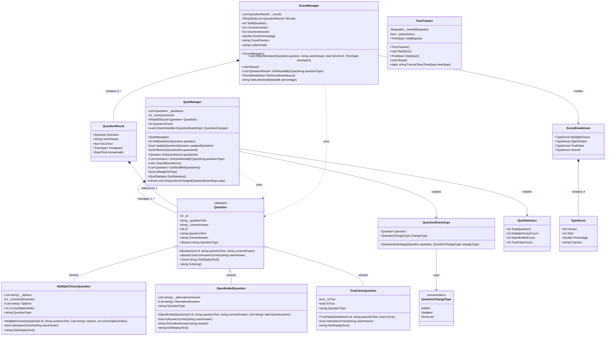

# UML Class Diagram - Geography Quiz Game

## Overview
This comprehensive UML Class Diagram illustrates the object-oriented architecture of the Geography Quiz Game, demonstrating inheritance, encapsulation, abstraction, and polymorphism principles as required for COMP1551 coursework.

## Class Diagram

## Relationship Details

### Inheritance Relationships (Hollow Triangle Arrows)
- **Question** ← **MultipleChoiceQuestion** (1:1 inheritance)
- **Question** ← **OpenEndedQuestion** (1:1 inheritance)  
- **Question** ← **TrueFalseQuestion** (1:1 inheritance)

### Composition Relationships (Filled Diamond)
- **QuizManager** ◆→ **Question** (1 to many - QuizManager owns Questions)
- **ScoreManager** ◆→ **QuestionResult** (1 to many - ScoreManager owns Results)
- **QuestionResult** ◆→ **Question** (1 to 1 - QuestionResult contains Question reference)
- **ScoreBreakdown** ◆→ **TypeScore** (1 to 4 - contains MultipleChoice, OpenEnded, TrueFalse, Overall)

### Association Relationships (Simple Arrows)
- **QuizManager** → **QuestionEventArgs** (creates events)
- **QuizManager** → **QuizStatistics** (generates statistics)
- **ScoreManager** → **ScoreBreakdown** (creates breakdown analysis)

### Dependency Relationships (Dashed Arrows)
- **QuestionEventArgs** ⇢ **QuestionChangeType** (uses enum)

## Multiplicity Indicators

| Relationship | Multiplicity | Description |
|-------------|-------------|-------------|
| QuizManager → Question | 1 to * | One QuizManager manages many Questions |
| ScoreManager → QuestionResult | 1 to * | One ScoreManager contains many QuestionResults |
| QuestionResult → Question | * to 1 | Many QuestionResults reference one Question |
| ScoreBreakdown → TypeScore | 1 to 4 | One ScoreBreakdown contains exactly 4 TypeScores |

## Visibility Indicators

| Symbol | Visibility | Usage |
|--------|-----------|-------|
| + | Public | Properties, public methods, constructors |
| - | Private | Private fields, private helper methods |
| # | Protected | Protected constructors, protected virtual methods |

## Abstract Elements (Italics in Implementation)

### Abstract Class
- **Question** - Cannot be instantiated directly

### Abstract Members
- **Question.QuestionType** - Abstract property, must be implemented by subclasses
- **Question.IsAnswerCorrect()** - Abstract method, must be implemented by subclasses

### Virtual Members
- **Question.GetDisplayText()** - Virtual method, can be overridden by subclasses
- **QuizManager.OnQuestionChanged()** - Virtual method for event handling

## OOP Principles Demonstrated

### 1. Inheritance
- **Question** serves as abstract base class
- **MultipleChoiceQuestion**, **OpenEndedQuestion**, **TrueFalseQuestion** inherit from Question
- Common properties and methods defined in base class
- Specialized behavior implemented in derived classes

### 2. Encapsulation
- Private fields with public property accessors
- Data validation in property setters
- Internal state protected from direct access
- Clear public interface for each class

### 3. Abstraction
- **Question** abstract class defines contract for all question types
- Abstract methods force implementation in concrete classes
- Complex internal logic hidden behind simple public interfaces
- Manager classes abstract away data management complexity

### 4. Polymorphism
- **IsAnswerCorrect()** method behaves differently for each question type
- **GetDisplayText()** method customized per question type
- Questions can be treated uniformly through base class reference
- Runtime method resolution based on actual object type

## Design Patterns Implemented

### 1. Template Method Pattern
- **Question.GetDisplayText()** provides base implementation
- Subclasses can override to customize display format

### 2. Strategy Pattern
- Different answer validation strategies in **IsAnswerCorrect()** implementations
- Each question type has unique validation logic

### 3. Observer Pattern
- **QuizManager.QuestionChanged** event notifies UI of data changes
- **QuestionEventArgs** carries event information
- Loose coupling between data layer and presentation layer

### 4. Repository Pattern
- **QuizManager** acts as repository for Question objects
- Provides CRUD operations and query methods
- Encapsulates data access logic

## Class Responsibilities

### Models Layer
- **Question**: Abstract base defining common question interface
- **MultipleChoiceQuestion**: Handles 4-option questions with index-based answers
- **OpenEndedQuestion**: Manages text-based answers with alternative answer support
- **TrueFalseQuestion**: Processes boolean questions with flexible input formats

### Managers Layer
- **QuizManager**: CRUD operations, question management, event notifications
- **ScoreManager**: Score calculation, result tracking, performance analysis
- **TimeTracker**: Quiz timing, stopwatch management, time formatting

### Supporting Classes
- **QuestionResult**: Individual question answer data
- **QuestionEventArgs**: Event data for question changes
- **QuizStatistics**: Aggregate statistics about quiz content
- **ScoreBreakdown**: Detailed performance analysis by question type
- **TypeScore**: Score metrics for specific question types
- **QuestionChangeType**: Enumeration of possible question changes

This UML Class Diagram demonstrates comprehensive object-oriented design principles and serves as complete documentation for the Geography Quiz Game architecture, fulfilling all COMP1551 coursework requirements for Part 3 UML documentation.
